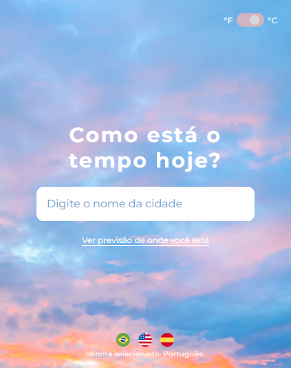
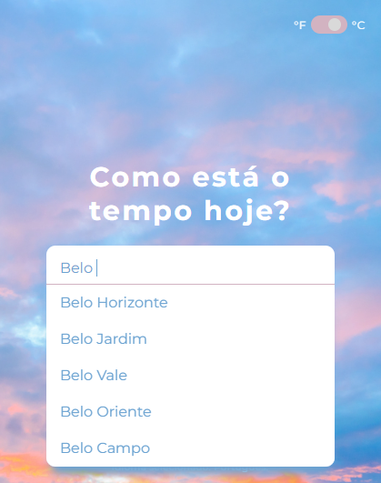
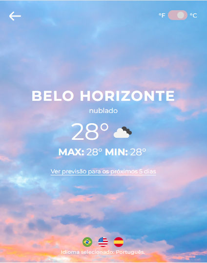
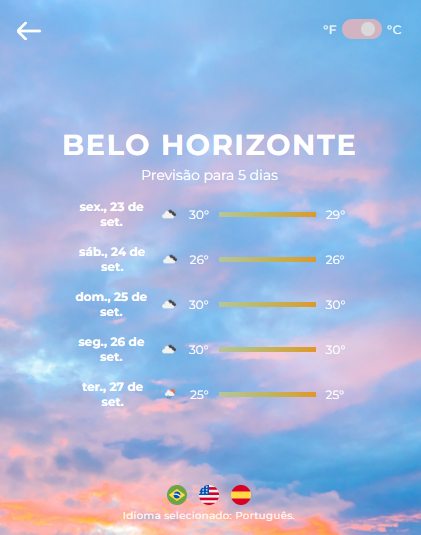

## Sobre o projeto
Aplicação feita em um desafio técnico de um processo seletivo para vaga Frontend, onde a ideia era fazer um projeto que identificasse o clima da cidade pesquisada através do [Open Wheater](https://openweathermap.org/api)
<div align="center"> 
    Desktop
  
</div>
<div align="center"> 
    <p>Mobile</p>
  
</div>
<br/>

### Stacks
<details>
  <summary>Client</summary>
  <ul>
    <li><a href="https://reactjs.org/">React.js</a></li>
    <li><a href="https://www.typescriptlang.org/">Typescript</a></li>
    <li><a href="https://developer.mozilla.org/en-US/docs/Web/CSS">CSS</a></li>
  </ul>
</details>

### Funcionalidades

- Internacionalização para inglês/espanhol;
- Busca do clima através de geolocalização;
- Trata escolha de escala de grau: Celsius ou Fahrenheit;
- Previsão do tempo para os próximos 5 dias;
- Layout responsivo;

### Variáveis de ambiente

Para rodar esse projeto, você precisará adicionar as seguintes variaveis de ambiente em um arquivo .env

`REACT_APP_GOOGLE_API_KEY`
 - [Usar chaves de API com a API Places](https://developers.google.com/maps/documentation/places/web-service/get-api-key)

`REACT_APP_WEATHER_API_KEY`
 - [Como chamar Open Weather APIs de graça](https://openweathermap.org/appid#signup)

## Começando

### Pré-requisitos

Antes de começar, você precisará ter instalado em sua máquina as seguintes ferramentas: [Git](https://git-scm.com/), [Node.js](https://nodejs.org/en/) e [Typescript](https://www.typescriptlang.org/).
   
### Rodar testes

Para rodar testes, escreva o seguinte comando

```bash
  npm run test
```

### Rodar localmanente

Clone o projeto

```bash
  git clone https://github.com/zirtaebn/weather-app--test.git
```

Vá para o diretório do projeto

```bash
  cd weather-app--test
```

Instale as dependências

```bash
  npm install
```

Inicie o servidor 

```bash
  npm start
```

## Uso

### Pesquise o nome da cidade e selecione o autocomplete
<div align="center">
    Desktop
    
    
</div>

<div  align="center">
    <p>Mobile</p>
    
    </br>
    
</div>


Clique no link para ver a temperatura dos próximos dias
<div  align="center">
    Desktop
    
</div>
<div  align="center">
    <p>Mobile</p>
    
</div>


## Contribuição

<a href="https://github.com/zirtaebn/weather-app--test/graphs/contributors">
  
</a>
</br>
Contribuições são sempre bem vindas!

## Contato

Beatriz Sant'Anna - [@zirtaebn](https://twitter.com/zirtaebn) - zirtaebndev@gmail.com

Link do projeto: [https://github.com/zirtaebn/weather-app--test](https://github.com/zirtaebn/weather-app--test)


## Reconhecimentos

Recursos e bibliotecas úteis que utilizei no projeto.
 - [Open Weather API](https://openweathermap.org/api)
 - [Axios](https://axios-http.com/ptbr/)
 - [React Router](https://reactrouter.com/en/main)
 - [React Query](https://react-query-v3.tanstack.com/)
 - [React Google AutoComplete](https://www.npmjs.com/package/react-google-autocomplete)